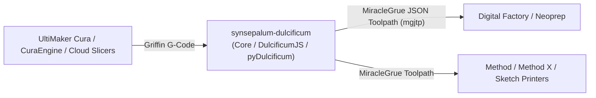

<!-- @generated from AGENTS.md by scripts/sync_agentic_configs.sh.
     Edit AGENTS.md and re-run the sync - do not edit this file. -->

# AGENTS.md — Orientation for AI Agents

> **What this file is:** everything an agent needs to understand *what this
> repository is and how to work in it*. It is orientation, not policy.
>
> **What this file is NOT:** it does not contain rules. Normative constraints —
> what you MUST and MUST NOT do — live in `.agents/rules/` and are enforced by
> hooks. Never restate a rule here; a duplicated rule drifts from the original
> and agents then follow the stale copy. See *Where Everything Lives* at the end.

---

## 1. What This Repository Is

**Repository:** `synsepalum-dulcificum`
**Ecosystem context:** UltiMaker Ecosystem (Digital Factory / Cura Cloud / Neoprep / Method Ecosystem)
**Purpose:** Named after the *miracle fruit* berry that alters sour taste to sweet, `synsepalum-dulcificum` translates 3D printing command dialects. Its primary responsibility is converting sliced Griffin G-Code toolpaths into MakerBot / Method series MiracleGrue JSON Toolpath (`mgjtp`) command representations.

### Key Capabilities
- Parses Griffin GCode using compile-time regular expressions (`ctre`) into structured ASTs (Header, Layers, Meshes, Features, Footer).
- Transforms GCode AST structures into intermediate polymorphic `botcmd::Command` objects.
- Serializes `botcmd::Command` streams into MiracleGrue JSON Toolpaths (`mgjtp`) with configurable extruder count indexing.
- Provides multi-target interfaces: native C++20 static library (`dulcificum`), WebAssembly/embind worker (`DulcificumJS`), Python bindings (`pyDulcificum`), and a CLI translator tool (`apps/translator`).

---

## 2. Tech Stack

- **Core C++**: Modern C++20, compiled natively with CMake (≥3.23) and Conan 2 (≥2.7.0).
- **WebAssembly**: Emscripten + embind (`DulcificumJS`) targeting web, worker, and Node.js runtimes, generating `dulcificum_js.js` and TypeScript types (`dulcificum_js.d.ts`).
- **Python Bindings**: pybind11 (`pyDulcificum`) wrapping CPython 3.12.
- **Libraries**: `nlohmann_json`, `range-v3`, `spdlog`, `fmt`, `ctre`, `docopt.cpp`.
- **Quality & Testing**: GoogleTest + CTest, `clang-format`, `clang-tidy`.

---

## 3. Position in the Wider System

`synsepalum-dulcificum` sits between slicing engines and printer execution runtimes:



- **Consumers**:
  - **Neoprep / UltiMaker Digital Factory**: Imports `DulcificumJS` as a WASM module in web workers to convert sliced GCode directly in the browser or cloud pipeline.
  - **Cura & Python Services**: Consumes `pyDulcificum` or native Conan package `dulcificum`.
  - **CLI / Batch Pipelines**: Uses `apps/translator` for standalone command-line file conversions.

---

## 4. Architecture and Domain Concepts

### Dialects and Abstractions
1. **Griffin G-Code Dialect**: UltiMaker's structured GCode dialect with semantic comment markers:
   - Header metadata: `;START_OF_HEADER`, `;BUILD_PLATE.INITIAL_TEMPERATURE`, `;EXTRUDER_TRAIN.<n>.INITIAL_TEMPERATURE`.
   - Structural markers: `;LAYER:<idx>`, `;MESH:<name>`, `;TYPE:<feature_type>`.
   - Machine commands: `M104`/`M109` (extruder temp), `M140`/`M190` (bed temp), `M106`/`M107` (fan), `M204`/`M205` (acceleration/jerk), `G0`/`G1` (linear moves), `G92` (coordinate reset), `G280` (purge).
2. **MiracleGrue JSON Toolpath (`mgjtp`)**: MakerBot Method execution dialect represented as an array of JSON objects with `function` names (e.g. `move`, `change_toolhead`, `fan_duty`), `parameters`, and semantic `tags` (e.g. `WALL-OUTER`, `FILL`, `ROOF`, `TRAVEL_MOVE`).

### Translation Pipeline
The core translation pipeline follows a strict two-stage decoupling:
1. `gcode::parse(content)` parses text using `ctre` into `GCodeAST` (`include/dulcificum/gcode/parse.h`, `src/gcode/parse.cpp`).
2. `gcode::toCommand(gcode_ast)` converts AST elements into a vector of intermediate `std::shared_ptr<const Command>` objects (`src/gcode/gcode_to_command.cpp`).
3. `miracle_jtp::toJson(*command)` serializes each intermediate command to JSON matching `mgjtp` schema (`src/miracle_jtp/mgjtp_command_to_json.cpp`).
4. `GCode2Miracle_JTP(content, nb_extruders)` orchestrates the full pipeline in `include/dulcificum.h`.

### Key Architectural Invariants
- **Stateless Core**: Translation functions are stateless; dynamic configuration (such as extruder count via `k_key_str::init`) must be handled deterministically per conversion.
- **WASM Boundary Isolation**: No C++ exceptions may cross the Emscripten/embind boundary in `DulcificumJS/DulcificumJS.cpp`.
- **Platform Separation**: All Emscripten headers and build logic remain isolated inside `DulcificumJS/`; the core library in `src/` and `include/` remains portable native C++20.

---

## 5. Directory Map

| Directory | Purpose | Key Content |
|---|---|---|
| `include/` | Public C++ headers | `dulcificum.h`, `command_types.h`, `gcode/`, `miracle_jtp/`, `utils/` |
| `src/` | Core C++ implementation | `gcode/parse.cpp`, `gcode/gcode_to_command.cpp`, `miracle_jtp/` |
| `DulcificumJS/` | WebAssembly / Emscripten bindings | `DulcificumJS.cpp`, `CMakeLists.txt`, `README.md` |
| `pyDulcificum/` | Python bindings (pybind11) | `pyDulcificum.cpp`, `CMakeLists.txt` |
| `apps/` | Standalone CLI tools | `translator_main.cpp`, `cmdline.h`, `CMakeLists.txt` |
| `tests/` | Unit and dialect tests | GoogleTest suites, `miracle_jsontoolpath_dialect_test.cpp`, `data/` |
| `doc/` | Architectural documentation | PlantUML architecture diagram `griffin.puml` |
| `test_package/` | Conan 2 package consumer test | `conanfile.py` |

---

## 6. Local Development & Verification

### Build Commands
```bash
# Native CMake build
mkdir -p build && cd build
cmake .. -DENABLE_TESTS=ON -DWITH_APPS=ON -DWITH_PYTHON_BINDINGS=OFF
cmake --build .

# Conan 2 build
conan build .
```

### Test Commands
```bash
# Run unit tests via CTest
ctest --test-dir build --output-on-failure
```

### WebAssembly Build (via Emscripten)
```bash
conan install . -s build_type=Release --build=missing -c tools.build:skip_test=True -pr:h cura_wasm.jinja
```

### Formatting & Linting
```bash
clang-format -i include/**/*.h src/**/*.cpp DulcificumJS/*.cpp apps/*.cpp
```

---

## 7. Where Everything Lives

| Layer | Answers | Location |
|---|---|---|
| **Orientation** | What is this, how do I work in it? | this file (`AGENTS.md`) |
| **Rules** | What must I do, what must I never do? | `.agents/rules/*.md` (symlinked into `.claude/rules/`, `.opencode/rules/`) |
| **Mechanical enforcement** | What does the tooling refuse, regardless of intent? | `.agents/hooks/*` and `.pre-commit-config.yaml` |
| **AI exclusion** | What must never be read by a model? | `.aiignore` (compiled into each platform's mechanism) |
| **What was inferred** | Why is this configured the way it is? | `.agents/bootstrap-profile.json` |
| **Open proposals** | What might still become a rule? | `.agents/bootstrap-observations.md` |

### Rule Bands
| Band | Load tier | Owner |
|---|---|---|
| `01`–`14` | always on | managed — regenerated by the bootstrap |
| `15`–`19` | always on | this repository — never touched by the bootstrap |
| `20`–`34` | glob-scoped (`paths:`) | managed — regenerated by the bootstrap |
| `35`–`39` | glob-scoped (`paths:`) | this repository |
| `40`–`44` | model decision | managed — regenerated by the bootstrap |
| `45`–`59` | model decision | this repository |

### Relevant UltiCortex Skills
Load the corresponding skill before implementing:
- `conan-2` — Conan 2 dependency management, recipes, and profiles
- `cmake` — CMake 3/4 target-centric build architecture
- `cpp-pro` — Modern C++20/23 architecture and memory safety
- `python-pro` — Type-safe Python bindings development
- `software-architect` — Architectural decomposition and pattern design
- `ultimaker-neoprep-development` — Neoprep integration and WASM module consumption
- `ultimaker-curator-development` — Toolpath and configuration resolver patterns
